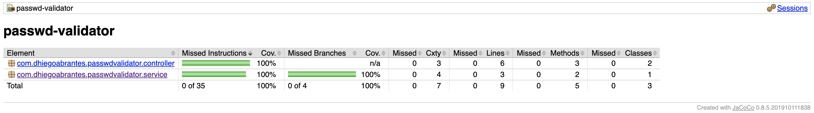

# Password Validator API
A API é especializada em validação de formato de senha.<br>
Os requisitos mínimos para um formato de senha aceitável são:
* Mínimo de 9 caracteres
* Conter pelo menos um dígito
* Conter pelo menos uma letra minúscula
* Conter pelo menos uma letra maiúscula
* Conter pelo menos um caractere especial

## Ferramentas Utilizadas
* Java 11
* Spring Boot 2
* Spring Actuator
* Lombok 1.18
* JUnit 5
* Swagger 2
* JaCoCo 0.8.5
* Docker

## Sobre a API
A API é responsável por validar formato de valores que serão utilizados como senha e está disponível no formato REST.

A documentação e client web foram dispibilizados através do Swagger e, uma vez que a aplicação estiver em execução,
poderá ser acessado através da [URL](http://localhost:8080/swagger-ui.html).


* Método HTTP: POST
* Path: `/passwd-validator`

O método POST foi utilizado para evitar que a senha fosse exposta na URL da requisição.

### Como utilizar?

```bash
curl -X POST "http://localhost:8080/passwd-validator" \
        -H "accept: application/json" \
        -H "Content-Type: application/json" \
        -d "{ \"word\": \"0MyP4sswd!\"}"
```

O retorno é um objeto JSON com o seguinte formato:

```json5
{
    "valid": true
}
```

Ou,

```json5
{
    "valid": false
}
```

Conforme já mencionado, é possível efetuar requisições e verificar as respostas utilizando o Swagger, através da [URL](http://localhost:8080/swagger-ui.html).

## Executando a aplicação
Existem alguns requisitos mínimos para executar a aplicação:
* Java 11 ou superior
* Caso queira executar em container docker, necessitará o Docker instalado

É possível executar a aplicação de duas formas e, para isso, é necessário fazer um clone do repositório ou download do código fonte. <br>
Por padrão, a porta utilizada foi a `8080`.

### Clone ou Download do repositório

Após fazer o clone ou download, basta acessar a pasta raiz do projeto e executar o seguinte comando:
```bash
./build-and-run.sh
```

Através desse comando será feito o build da aplicação e, em seguida, a execução.

### Executando em um container docker
Após fazer o clone ou download, basta acessar a pasta raiz do projeto e executar o seguinte comando:
```bash
./build-and-dockerize-and-run.sh
```

Através desse comando, as seguintes taks são executadas:
* Build do projeto
    * Clean de diretórios
    * Compilação de artefato
    * Execução de testes unitários e de integração
    * Check de regra de cobertura mínima de código (90%)
    * Geração de relatório de cobertura de testes
* Criação da imagem docker contendo o artefato atualizado
* Criação e execução do container

### Considerações Técnicas

#### Sobre code coverage
O projeto está configurado com `minimum code coverage` de 90% e o build somente terá sucesso se essa regra for respeitada.

Acessando a raíz do projeto e utilizando o comando abaixo é possível efetuar o build.

```bash
./gradlew clean build
```

Os relatórios de cobertura de teste estarão disponíveis na raíz do projeto, no path: `/build/jacocoHtml/index.html`



Algumas classes foram desconsideradas na checagem da cobertura dos testes e na geração do relatório:
* Classes contidas nos pacotes
    * `com.dhiegoabrantes.passwdvalidator.dto` (Data Transfer Objects)
    * `com.dhiegoabrantes.passwdvalidator.config` (Classes de configuração)
* Classe de inicialização do projeto, `PasswdValidatorApplication.class`.
* Código gerado pelo Lombok, configurado com o `lombok.config`.

Conforme o projeto evolua, caso seja necessário ignorar mais classe ou pacotes, é possível através da variável `classesToIgnore` no arquivo `build.gradle`. O conteúdo da variável é utilizado nas tasks `jacocoTestReport` e `jacocoTestCoverageVerification`, que são executadas no build.

#### Health Checking
Foi utilizado o Spring Actuator para disponibilizar uma API que pode ser utilizada para checar a saúde do serviço.

* Método HTTP: GET
* Path: `/actuator/health`

O retorno é um objeto JSON no seguinte formato:

```json5
{
  "status": "UP"
}
```

Ou,

```json5
{
  "status": "DOWN"
}
```